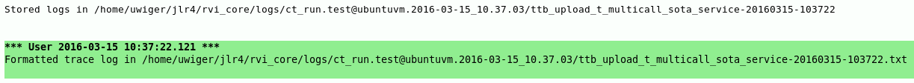
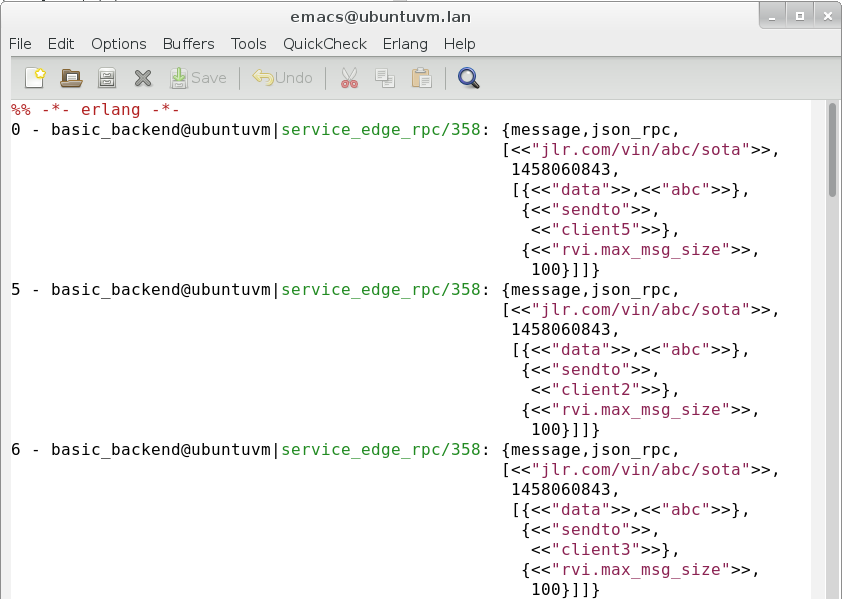
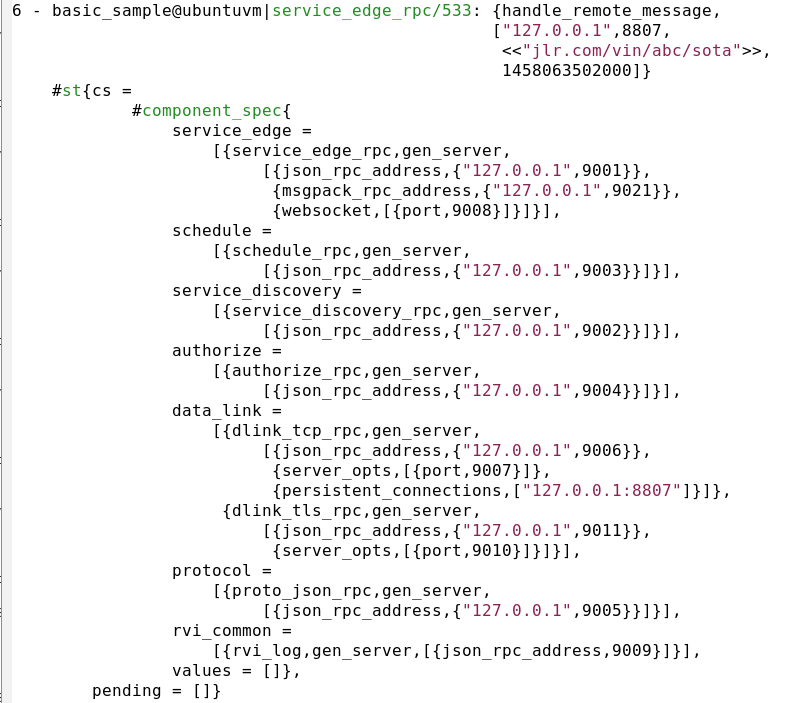

# trace_runner
A wrapper for tracing test runs using TTB.

This component is based on [locks_ttb](https://github.com/uwiger/locks/blob/master/src/locks_ttb.erl), whose main purpose was to be used in complicated
multi-node test cases: a wrapper around the test case sets up a multi-node
trace using ttb; if the test case succeeds, the traces are discarded, but
if it fails, the logs are fetched, merged and formatted for 'easy' viewing.

The idea is complemented with the notion of using an `event()` function,
whose only purpose is to be traced. This can serve as extremely lightweight
runtime debugging statements. Since the `event()` function only returns
`ok`, the whole operation is cheaper than any runtime test for debug level
could be. the `include/trace_runner.hrl` include file defines `?event`
macros that can be used, including one that tests whether the `event()`
function is traced, before evaluating the argument expression. This can
be used to 'pretty-print' the arguments to the `event()` function without
incurring overhead when not tracing (obviously there is *some* overhead in
checking the trace status).

Example (from https://github.com/PDXOstc/rvi_core, although at the time of writing, the trace_runner support hasn't yet been merged)

First, we create a callback module for the `tr_ttb` behavior, which
lets us specify trace patterns and trace flags.

```erlang
patterns() ->
    [{authorize_rpc        , event, 3, []},
     {service_edge_rpc     , event, 3, []},
     {service_discovery_rpc, event, 3, []},
     {dlink_tcp_rpc        , event, 3, []},
     {connection           , event, 3, []},
     {dlink_tls_rpc        , event, 3, []},
     {dlink_tls_conn       , event, 3, []},
     {dlink_bt_rpc         , event, 3, []},
     {bt_connection        , event, 3, []},
     {dlink_sms_rpc        , event, 3, []},
     {schedule_rpc         , event, 3, []},
     {proto_json_rpc       , event, 3, []},
     {proto_msgpack_rpc    , event, 3, []},
     {rvi_common           , event, 3, []},
     {?MODULE              , event, 3, []}
     | tr_ttb:default_patterns()].

flags() ->
    {all, call}.
```

Then, we instrument our test suite(s):

```erlang
t_multicall_sota_service(Config) ->
    with_trace(fun t_multicall_sota_service_/1, Config,
     	       "t_multicall_sota_service").

t_multicall_sota_service_(_Config) ->
    %% the actual test case
    Data = <<"abc">>,
    ...
```

In the wrapper, we determine which nodes to include in the trace,
give the trace a name, then call the test case within a try ... catch.
If the test succeeds, we call `stop_nofetch()`, discarding the trace,
otherwise, we fetch the trace logs and merge them, pretty-printing
the result.

```erlang
with_trace(F, Config, File) ->
    Nodes = [N || {N,_} <- get_nodes()],
    rvi_ttb:on_nodes([node()|Nodes], File),
    try F(Config)
    catch
	error:R ->
	    Stack = erlang:get_stacktrace(),
	    ttb_stop(),
	    ct:log("Error ~p; Stack = ~p", [R, Stack]),
	    erlang:error(R);
	exit:R ->
	    ttb_stop(),
	    exit(R)
    end,
    rvi_ttb:stop_nofetch(),
    ok.

ttb_stop() ->
    Dir = rvi_ttb:stop(),
    Out = filename:join(filename:dirname(Dir),
			filename:basename(Dir) ++ ".txt"),
    rvi_ttb:format(Dir, Out),
    ct:log("Formatted trace log in ~s~n", [Out]).
```

On test failure, this would result in the following output in the CT log:



The formatted text log has an emacs erlang-mode header, so is best
viewed in emacs.



Note that the log formatter prefixes each message with the relative time
(in ms) since the start of the trace, the name of the node where the
trace event originated and the module/line of the traced call.
It also tries to pretty-print records, looking for a
`record_fields(RecName)` callback in the module named in the call trace.



A `record_fields/1` function might look like this:

```erlang
record_fields(service_entry)	-> record_info(fields, service_entry);
record_fields(st           )	-> record_info(fields, st);
record_fields(component_spec)	-> record_info(fields, component_spec);
record_fields(_)		-> no.
```

In the future, more log formatting options may be added.
Pull requests are welcome.
