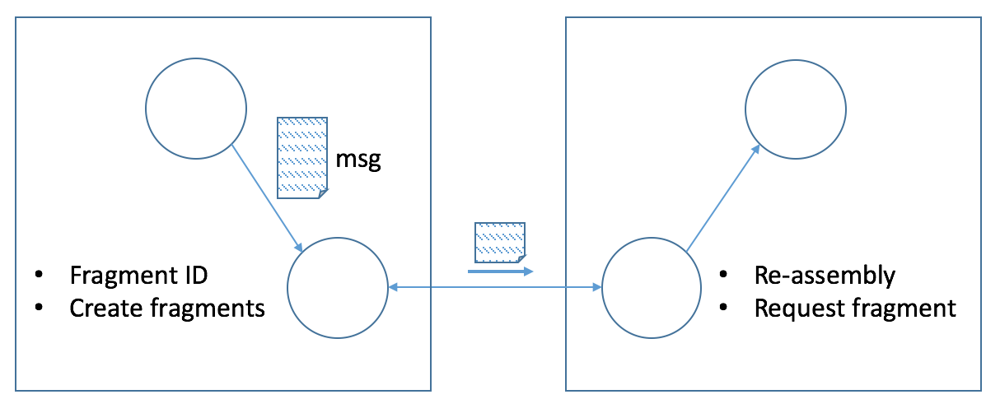

# The RVI Core Fragmentation Protocol

## Abstract

The Remote Vehicle Interaction (RVI) system is a framework for secure
interaction between vehicles and other devices and/or cloud services.
RVI is designed to be agnostic in regard to connectivity options and
intermittent connectivity. One consequence of this is that large messages
may have to be partially transmitted via one type of connection, and completed
on another. The fragmentation protocol described below allows for varying
Message Transfer Unit (MTU) and lets the remote client request fragments
as needed.

## Status of This Memo

This document is not an Internet Standards Track specification; it is
published for informational purposes.

## Copyright Notice

Copyright (C) 2016 Jaguar Land Rover

This document is licensed under Creative Commons
Attribution-ShareAlike 4.0 International.

## Table of Contents

1. [Introduction](#introduction)
2. [Terminology](#terminology)
3. [System Overview](#system-overview)
4. [Notation](#notation)
5. [References](#references)

## Introduction

## Terminology

Term      | Meaning
----------|--------------------------------
`Client`  | Sending side of the interaction
`Server`  | Receiving side of the interaction
`MTU`     | Message Transfer Unit

## System Overview

The fragmentation support is intended to operate immediately on top of the transport
layer. In essence, the sending side (Client) asks the fragmentation support to 
deliver a message. The fragmentation support determines whether fragmentation is
needed. If it is, it will create a first fragment, encode it and send it to the 
receiving end (Server).

The fragmentation support can operate over a transport using its own fragment/reassembly
method (such as TCP), but does not require it, or makes any such assumptions.

## Notation

The fragmentation protocol does not specify any particular encoding method.
In this document, JSON notation is used. In practice, a byte-oriented JSON-like
encoding, like msgpack [MSGP] would be more suitable.

## Messages

<img src="images/rvi_protocol_frag1.png"

The fragment messages are deliberately compact, in order to steal as little of
the available transfer window from the fragment itself.

**Fragment message:**

    { "frg": [ id, size, offset, fragment ] }

The sending side initiates fragment transfer by sending a first fragment. The
size of the first fragment is determined by the sending side. Subsequent fragments
are requested by the receiver, in which case the receiver also decides how large
a fragment it wants. The sender is allowed to send a smaller fragment, but not
a larger one.

Note that `size` denotes the size of the *whole* message, not the fragment.

**Fragment request message:**

    { "frg-get": [ id, offset, size ] }

This message is sent by the receiving side in order to request the next fragment.
The `offset` will typically be the position following the most recently received
fragment, but could also represent a "hole" in the message from a missing fragment.

**Fragment acknowledgement message:**

    { "frg-end": [ id, result_code ] }

**Fragment error message:**

    { "frg-err": [ id, result_code ] }

`id` (string): Message identity. This value needs to be unique within the scope
of the current connection.

`size` (integer): A positive integer denoting either the size of the whole message
(as in the `"frg"` message) or the size of the requested fragment (as in the `"frg-get"`
message).

`offset` (integer): A positive integer denoting the starting byte of the fragment,
relative to the whole message. The first fragment starts at `1`.

`fragment` (binary): A byte sequence denoting the current fragment. Note that the
`"frg"` message doesn't contain a size indicator for the fragment. However an
encoding such as [MSGP] does include a size indicator.

`result_code` (integer): A number denoting the outcome of the transfer and reassembly.
A zero (`0`) means all went well; a negative number indicates failure. Predefined values
are:

Code or range | Definition
--------------| ----------------------
`0`           | Message was successfully transfered and reassembled
`-99 ... -1`  | Reserved for standard error codes
`-1`          | Unknown message (i.e. in a `"frg-err"` response to a `"frg-get"` message)
`-2`          | Protocol error
`-3`          | Timeout error
`< -99`       | Application-defined error codes

## References

[RVI]  Remote Vehicle Interaction (RVI)
       https://github.com/PDXOstc/rvi_core
[MSGP] msgpack encoding
       http://msgpack.org