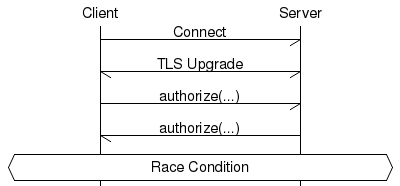
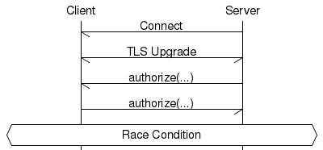
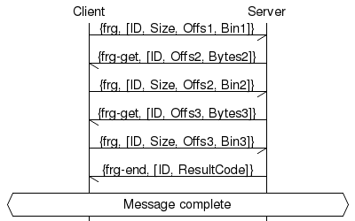

<style type="text/css" media="print"> div.pb { page-break-before: always; }</style>
Copyright (C) 2015-16 Jaguar Land Rover

This document is licensed under Creative Commons
Attribution-ShareAlike 4.0 International.

# RVI CORE PROTOCOL
This document describes the core protocol between two RVI nodes.

For all examples below the certificates and credentials used are the samples
created as described in [rvi_certificates.md](rvi_certificates.md).

# STANDARDS USED
[1] [Transport Layer Security - TLS](https://tools.ietf.org/html/rfc5246)<br>
[2] [JSON Web Token RFC7519 - JWT](https://tools.ietf.org/html/draft-ietf-oauth-json-web-token-32)<br>
[3] [MessagePack](http://msgpack.org/index.html)<br>
[4] [base64url](https://en.wikipedia.org/wiki/Base64)<br>
[5] [X.509 Certificates](https://en.wikipedia.org/wiki/X.509)<br>

# FEATURES COVERED BY PROTOCOL
1. **Authorization**<br>
Prove to the remote RVI node that the local RVI node has the right to
invoke a set of services, and the right to receive invocations of another set of services.

2. **Service Discovery**<br>
Announce to the remote RVI node local RVI services which the remote node
is authorized to invoke.

3. **Service Invocation**<br>
Invoke services on remote RVI nodes.

# FEATURES NOT COVERED BY PROTOCOL
For all but the last item, TLS 1.2 [1] an be used as an underlying
protocol to provide the features lacking in RVI Core protocol.

1. **Authentication**<br>
Prove the identity oof a local RVI node to the remote RVI node.

2. **Encryption**<br>
Encrypt data between two RVI nodes to avoid eavesdropping.

3. **Replay attack protection**<br>
Replay an earlier RVI Core protocol session to engage with an RVI node again.

4. **Man in the middle attack protection**<br>
Terminate an RVI Core protocol connection, modify incoming data and forward it
to its original destination.

5. **Key Management**<br>
Public Key Infrastructure and certificate distribution.

6. **RVI Node Discovery**<br>
Allowing two unconnected RVI nodes to discover each other so that they can initiate connection.

<div class="pb"></div>

# OVERVIEW
The RVI core protocol is the default protocol used between two RVI
nodes once they have become aware of each other's presence.

The stack schematics is shown below.


## RVI Core protocol codec
The RVI core protocol uses MessagePack [3] as its
encoder/decoder to transmit JSON structures. All JSON structures described in
this protocol are encoded as MessagePack prior to transmission to the remote
peer.

## Certificates and credentials
Three types of certificates and credentials are used by the RVI Core
protocol in conjunciton with TLS. See [5] for details on X.509.

1. **Root certificate [X.509]**<br>
Generated by a trusted provisioning server and pre-provisioned on all
RVI nodes. Self signed. Used to sign all RVI certificates.
Used to sign all device certs.

2. **Device certificate (X.509)**<br>
Per-device certificate.  Signed by root cert. Used by TLS for initial
authentication.

3. **RVI credentials (JWT)**<br>
Describes the services that the device has the right to invoke and the
services that the device has right to have invoked by remote nodes.
Embeds the device X.509 certificate as a PEM-encoded string.
Signed by root cert.

<div class="pb"></div>

## Integration between TLS and RVI Core RVI
Client and server X.509 certificates are exchanged when the original
TCP connection is upgraded to TLS.  Once a X.509 certificate has
been validated by the receiving party party, it will be matched
against the PEM-encoded X.509 certificate embedded in received
RVI credentials.

The figure below shows how this is done.


## JSON Web token usage
JSON Web Tokens (JWT) [2] are used to encode RVI credentials, which are
signed by the root x.509 certificate.

# PROTOCOL FLOW

The messages used for illustration below are all presented in JSON format.
Other encodings (currently only msgpack) are supported, but all RVI messages
can be encoded as JSON. Each message is identified by a `"cmd": Cmd`
attribute, where `Cmd` can be `"au"`, `"sa"`, `"rcv"`, `"frg"`, `"ping"`.

The receiver of a message should be able to handle the presence of attributes
other than the ones described here.

## Sequence Diagram

The diagram below outlines the sequence between the client and the server.
Please note that the protocol is fully symmetrical and that the
client-server terminology only denotes who initiates the connection
(client), and who receives that connection (server).


<div class="pb"></div>

## Authorize command
The ```authorize``` command contains a list of RVI credentials, each specifying
a set of services that the sender has the right to invoke on the receiving node,
and a set of services that the sender has the right to have invoked.

```json
{"cmd"  : "au",
 "ver"  : "1.1",
 "id"   : "genivi.org/mobile/c60465c4-6324-11e6-b617-000c29690f82",
 "creds": [ "eyJhbGci..." ]
}
```

Attributes that may be present, but not currently used: `"addr"`, `"port"`.

Please see the [rvi_certificates.md](rvi_certificates.md) document for details on RVI credentials.

## Service Announce command
The ```service_authorize``` command contains a list of services
available on the sender that match services listed in RVI credentials
received from the remote party.

```json
{"cmd"  : "sa",
 "stat" : "av" | "un",
 "cost" : 1,
 "svcs" : [ "genivi.com/vin/d32cef88-.../hvac/seat_heat_left", ... ]
}
```

The `"stat"` attribute can have the value `"av"` (available) or `"un"` (unavailable) and indicates the status of all services listed in `"svcs"`.

The `"cost"` argument reflects the number of hops traversed, possibly also
including link cost and routing cost. Normally, link cost and routing cost
will be 1 each. An RVI node may relay a service announcement message to other
connected nodes, provided they are authorized to invoke the services listed.
Note that each connected node may be authorized to see a different subset of
the included services. When relaying an announcement, the node should add
link cost and routing cost to the received cost.

A max cost should be configured, to e.g. avoid routing loops. Any service
announcements that would exceed the max cost should not be sent.

## Message command
The ```message``` command contains a service name and a number of
arguments to be presented to the corresponding service at the
receiving end.  This is an asynchronous command that does not expect
an answer. Replies, publish/subscribe, and other higher-level
functions are (for now) outside the scope of the RVI Core protocol.

```json
{"cmd"   : "rcv",
 "tid"   : Tid,
 "mod"   : Mod,
 "data"  : Data
}
```

Note: The `"tid"` attribute is currently not checked by RVI.

The content of `Data` is parsed and then encoded according to the
protocol used to forward the message. The module `"rvi"` expects it to be
a 'struct' (or corresponding), as follows:

```json
{"service"  : ServiceName,
 "timeout"  : Timeout,
 "synch"    : Synch,
 "reply_id" : ReplyId,
 "route"    : Route,
 "files"    : [F1, ... Fn],
 "max_msg_size" : Sz,
 "reliable" : true | false,
 "parameters: Parameters
}
```

`Timeout` is either a relative time in milliseconds, or an absolut time
(unix time) in seconds.

`Parameters` is a 'struct' containing named arguments to be passed to the
service.

`Synch` is a boolean, where `true` means that the service reply shall be
routed back to the client. This is accomplished by the client-side RVI
node creating a temporary "service" on the form `Id/rvi/reply/Seq`, and
passing it along as `ReplyId`, where `Id` is the unique node id provided
in the `"au"` message, and `Seq` uniquely allows the client node to pair
the reply to the corresponding request.

`Route` is a list (array) of node identifiers, representing the reply
path of the message. If `Synch = false`, there is no need to maintain
the route entry, but if it is present, any relay node should prepend
its node id to the list before relaying the message.

The `"files"` entry contains a list (array) of file objects, representing
any attachments included in the request/message.

```json
{"cid"   : Filename,
 "hdrs"  : [ { Key: Value }, ...],
 "data"  : Data
}
```

If the client needs to refer to an attached file inside the request body,
it can use the pattern `file:Filename`. The `"hdrs"` list, if present,
contains HTTP headers used to pass the attachments via JSON-RPC (HTTP).
If the target service also uses HTTP, it can elect to receive exactly the
headers used by the client.

`MaxMsgSize` indicates if the message needs to be fragmented. Note that
the connection used may have its own `max_msg_size` setting; in that case,
the smallest value is used.

`Reliable` indicates that, regardless of max message size setting, the
fragmentation protocol should be used for reliable delivery, even if it
means sending only one fragment. This offers protection against packet
loss and message retransmission.

<div class="pb"></div>

## Double connect resolution
There is a risk that two parties try to initiate a connection to each
other in a race condition, creating two connections between them, as
shown below.

Connection 1 | Connection 2
:------:|:------:
 | 

A double connect can be detected by either side by checking if the
remote peer address already has a connection established.

In the diagram above, both the client and the server will initite a connection
to the other node at the same time.

Shortly afterwards, both will receive an incoming connection from the
other node.

By comparing the incoming connection's peer address against all other
connections' peer addresses, a match will be found in the outbound
connection just initiated.

Once a double connect has been detected, an implicit agreement is
reached to abort the connection initiated by the RVI node with the highest
address. If both RVI nodes share the same address (i.e. they
run on the same host), the connection with the highest source port is
aborted.

Below is a table with a number of double connect scenarios, showing which
connection would be termianted.

Node1 Address         | Node2 Address       | Connecting side to be terminated
----------------------|---------------------|------------------------------------
23.200.227.113:12831  | 144.63.252.10:33829 | Node2
192.26.92.30:11102    | 192.52.92.31:9884   | Node2
192.26.92.30:11102    | 192.52.92.30:11101  | Node1

The connection is terminated regardless of its current protocol
session state.

<div class="pb"></div>

## Chunking of large messages

RVI Core is able to split large messages into fragments and deliver them
reliably to the receiver; if the receiving end is an RVI node, re-assembly
is performed automatically. The fragmentation logic is called at the data link
level, so all messages, including RVI Core handshake messages, can be
fragmented.

The protocol is as follows:



### Enabling fragmentation

Fragmentation can be turned on either per data link type, or per message.

The two options that affect fragmentation are

* "reliable" (true | false): One fragment containing the whole message is
sent, and acknowledged with a "frg-end" message. This effectively enables
reliable message delivery.

* "max_msg_size" (Bytes): this specifies a maximum window size. RVI Core will
try to stay within the window size including the framing overhead, but this
will currently be unreliable when using JSON encoding, due to escaping of
binary data.

When including these options in the "parameters" list of a message invocation,
the names can be prefixed with "rvi.", e.g. "rvi.max_msg_size", or
"rvi.reliable".

**TODO**: Introduce timers. Currently there are none.

### Re-assembly

The receiving side is responsible for re-assembling the message and detect
holes (missing fragments). The sending side will only the first
fragment (with a starting offset of 1), and then wait for the receiving side
to request more fragments using "frg-get" messages. When the sending side
receives a "frg-end" message, it will forget about the message.

<div class="pb"></div>

### Encoding

By default, the fragmentation logic will use the same encoding as the
data link layer, but this is configurable. RVI Core currently supports
JSON and msgpack encoding. Of these two, msgpack is more efficient and
predictable for encoding binary data.

The RVI Core data link layers detect the encoding on a per-message basis.
This is possible, as all RVI Core messages are either structs (JSON) or
maps (msgpack), and these encodings are distinguishable on the first
non-whitespace byte.

Configuring fragmentation encoding in RVI Core is done for the specific
data link module, e.g.

```json
	{ data_link,
	  [ { dlink_tcp_rpc, gen_server,
	      [
                { frag_opts, {rvi_data_msgpack, []} },
		{ json_rpc_address, { 192.168.1.32, 8806 } },
		{ server_opts, [ { port, 8807 }]},
		{ persistent_connections, [ "192.168.1.10:8807" ]}
	      ]
	    }
	  ]
	}
```
