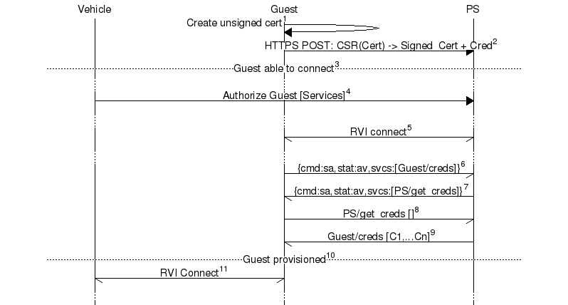

Copyright (C) 2015-16 Jaguar Land Rover

This document is licensed under Creative Commons
Attribution-ShareAlike 4.0 International.

# RVI SECURITY

This document summarizes security aspects of the RVI protocol and,
in particular, the RVI Core implementation.

## Service Edge

The Service Edge presents an API to applications using RVI, including
both services and service users. RVI Core supports the following
communication methods:

* JSON-RPC/HTTP

* JSON-RPC/Websocket

* DBUS

Currently, no security measures are implemented on the RVI Core side,
except for a simple peer IP whitelist in the HTTP server, which by default
allows connections only via loopback.

The Service Edge is responsible for validating incoming requests, as
well as authorizing service invocations, both received via the RVI
protocol and received via the Service Edge API.

RVI reserves the service prefix `NodeId/rvi/int` for internal services.
These should not be accessible via the Service Edge.

## RVI Protocol

### Legacy data link components

Previous RVI Core versions had a number of different, mostly unsecure,
data link components: dlink_tcp, dlink_bt (Bluetooth), dlink_sms.
These will be removed, and only the TLS version kept.

### Authentication

RVI relies on TLS 1.2 and X.509 certificates, supporting partial-chain
validation provided that the provisioning server's public key is installed
on the node.

An experimental configuration option exists to support anonymous
clients.

### Authorization

After a successful TLS upgrade, nodes exchange authorization (`"au"`)
messages. Apart from the `"id"` attribute, which uniquely identifies the node
(not enforced), the message includes credentials, defining which services
the node is allowed to invoke, and which services it can accept
invocations for.

Each credential includes the node's public key (PEM formatted), and
is encoded as a JSON Web Token (JWT), signed using the provisioning
server's private key. This combination is used to ensure that the
credential belongs to the node, and hasn't been modified since it was
issued.

### Service announcement

Each node shall announce services to its connected peers, but only
services which a peer is allowed to invoke. Service announcements from
connected peers are forwarded to other peers which are allowed to
invoke those services (note that the forwarded announcements may
include only a subset of the original services).

A hop count (`"cost"`) is included in the announcement to avoid
announcement loops.

RVI-internal services, starting with the prefix `NodeId/rvi/int`,
are never announced.

### Service invocation

When receiving a service invocation via RVI, the node must check whether
the peer is allowed to invoke the service.

RVI-internal services, starting with the prefix `NodeId/rvi/int`,
are implicitly allowed. These are normally used e.g. for service
invocation replies, are short-lived, not accessible via the
Service Edge, and not announced.

## Provisioning

A typical user/service provisioning flow may look like this.



Detailed description:

1. Guest creates an unsigned X.509 certificate
2. Guest sends a Certificate Signing Request (CSR) to the Provisioning Server (PS), passing the unsigned cert for signing. PS returns the cert, signed with its private key, and also creates and signs a credential file authorizing Guest to fetch further credentials from PS via the RVI protocol.
3. Guest is now able to connect to any device that recognizes PS as Root CA, but is not yet authorized to do anything except fetch more credentials.
4. Vehicle (owner) authorizes Guest to access certain services.
(if supported, and so configured, PS could in the future push credentials to Guest)
5. Guest connects to PS using RVI, authenticating itself with the newly signed certificate
7. Since PS is authorized to use the Guest/creds service, Guest announces its availability.
7. Since Guest has been authorized to use the PS/get_creds service, PS announces its availability.
8. Guest calls PS/get_creds, asking for new credentials.
9. PS calls Guest/creds, passing found credentials for Guest.
10. Guest can now connect to Vehicle and use the authorized services.
11. Guest connects to vehicle ...

### Provisioning delegates

It is possible to delegate authority via the credentials:

```json
"right_to_delegate": [
   {"right_to_invoke": ["InvPat1"],
    "right_to_receive": ["RcvPat1"]}
  ]
```

The device identified in the credential (via the `"device_cert"`) will be able to generate credentials authorizing access to services matching the given patterns. The delegation patterns themselves must be strict subsets of the patterns authorized to the device. (ISSUE: given regexp patterns, this may not be trivial to check).

A peer receiving such a credential, needs to be prepared to accept the credential owner as a signing authority for other credentials, and must also verify that any patterns given in such credentials are proper subsets of the delegation patterns.


## Erlang implementation

Erlang relies on a virtual machine, wich 'ports' to the outside world.
The VM is generally considered secure, except for the Distributed Erlang
protocol, which allows any node with knowledge of a secret cookie to
connect and essentially perform any operation on the node (i.e. no
sandboxing).

Any open ports are of course potentially insecure, although Erlang
data types are unbounded and memory management automatic, so some
conventional attack vectors (e.g. buffer overrun) are ineffective.

### Distributed Erlang

RVI Core currently uses Distributed Erlang for the `ctl` script,
mainly to check whether a node is running, and to stop it.
The node 'cookie' is set to a convenient value, which is a security
issue. Any user who gains access to the Linux shell can enter the
Erlang console with unlimited privileges.

### RVI Component ports

Early versions of RVI Core have supported replacing sub-components
(e.g. service discovery, routing, authentication) using JSON-RPC
interfaces for inter-component communication. These interfaces are
unprotected, and unlikely to be useful due to the relatively high
communication overhead. They also complicate the code. For these
reasons, they will be removed, and components will be Erlang-only,
relying on conventional Erlang interaction techniques.
