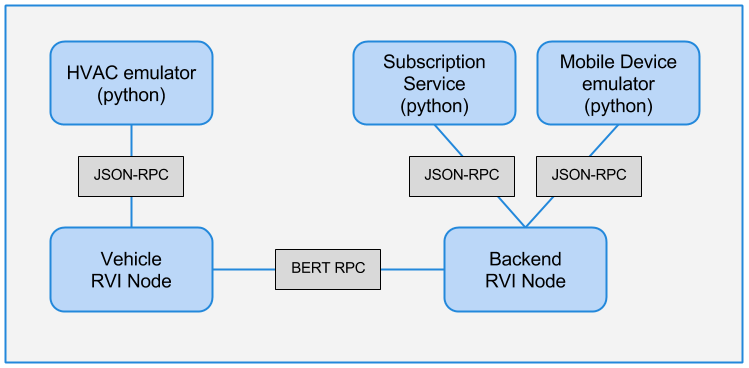

Copyright (C) 2014, Jaguar Land Rover

This document is licensed under Creative Commons
Attribution-ShareAlike 4.0 International.


# HVAC DEMO - VERSION 0.2
This document describes the purpose, setup, and launch of the HVAC
demo that is the first milestone of the RVI project.

# BACKGROUND
The remote HVAC control demo is a part of the Automotive Grade Linux
project where the Tizen IVI climate control (HVAC) screen can be
remotely controlled from a mobile device. Updates made to the IVI HVAC
screen are sent in real time to the mobile device, and vice versa.

An initial release of the remote HVAC demo was done using the MQTT
protocol (See http://mqtt.org). The first milestone of the RVI project
will migrate the HVAC demo to the RVI technology.

## READER ASSUMPTIONS
The reader is assumed to be able to:

1. Have a basic understanding of Linux directory structures.
2. Start and stop programs on the RVI-hosting system


# PREREQUISITES
1. Erlang runtime R16B01 or later has to be installed on the hosting system.
2. Git is installed on the hosting system.


# DEMO COMPONENTS

In order to test the RVI milestone 1 without having to bring up a
complete Tizen IVI and mobile device environment, a simple emulator
for these two components have been provided in hvac\_emulator.py and
mobile\_emulator.py

All components can be run on a single system.

Please see schematics below for an overview:

<br>
*Figure 1. Demo schematics. See HVAC and mobile device emulator chapters for details*


# DEMO SETUP
Two RVI nodes, both hosted by a single machine, will be involved in
the test:

The backend RVI node will the mobile emulator
(mobile\_emulator.py). The vehicle RVI node will host the HVAC
emulator (hvac\_emulator.py).

See [build instructions](../BUILD.md) for details on the prerequisites
for building and running the demo.


## INSTALL JSONRPCLIB FOR PYTHON

The python emulator code relies on [JSONRPClib](https://github.com/joshmarshall/jsonrpclib).
This python package can be installed using either one of the two commands listed below.

    sudo easy_install jsonrpclib
    sudo pip install jsonrpclib


## CHECK OUT THE RVI SYSTEM ##

    git clone https://gerrit.automotivelinux.org/gerrit/RVI/rvi


## SWITCH TO V0.2 OF THE RVI SYSTEM ##
The cloned gerrit repo contains all tags and branches.
Switch to tag v0.2 to get a release that does not contain
daily snapshots.

    cd rvi
    git checkout v0.2


## COMPILE THE RVI SYSTEM

    make


## CREATE THE VEHICLE DEVELOPMENT RELEASE

*See ../CONFIGURE.md for details on the configuration process.*

From the rvi root directory, setup the vehicle node:

    ./scripts/setup_rvi_node.sh -d -n vehicle -c hvac_demo/vehicle.config

The new developer release will be created in a subdiretory named ```vehicle```


## CREATE THE BACKEND DEVELOPMENT RELEASE
In a similar manner, setup the backend node:

    ./scripts/setup_rvi_node.sh -d -n backend -c hvac_demo/backend.config


The release will be created in a subdiretory named ```backend```

# DEMO LAUNCH

## LAUNCH THE BACKEND RVI NODE

In its own window, launch the backend rvi node that the subscription
service and mobile device emulator will connect to.

	./scripts/rvi_node.sh -n backend
	
Make a note of the Service Edge URL address printed out by the logging service.


## LAUNCH THE VEHICLE RVI NODE

* Please note that the backend node must be started before the vehicle node. *

In its own window, launch the vehicle RVI node that will serve the HVAC emulator.

	./scripts/rvi_node.sh -n vehicle

The VIN number that will be used by the mobile device are the digits
at the end of the "Node Service Prefix" printed out at the end of the
launch process. 

By default, the ```hvac_demo/vehicle.config``` file has its ```node_service_prefix```
entry set to ```jlr.com/vin/1234/```,
yielding a VIN of "1234". 


## LAUNCH THE HVAC EMULATOR

In its own window, launch the HVAC emulator and have it connect to
the vehicle RVI node.

    cd hvac_demo
    ./hvac_emulator.py http://127.0.0.1:8811
	
Modify the ```http://127.0.0.1:8811``` to match the Service Edge URL
reported by the vehicle RVI node.

At startup the HVAC emulator will report the VIN number that it is
associacted with. (Default 1234)

The HVAC emulator accepts \[key\] \[value\] input lines that are
distributed to all mobile devices controlling the VIN of the vehicle RVI
node.


## LAUNCH THE MOBILE DEVICE EMULATOR

In its own window, launch the mobile device emulator and have it
connect to the backend RVI node.

    cd hvac_demo
    ./mobile_emulator.py  http://127.0.0.1:8801 +1941231234 1234
	
Modify the ```http://127.0.0.1:8801``` to match the Service Edge URL
reported by the backend RVI node.

The phone number (+19491231234) is arbitrary, but has to be unique
across all running mobile device emulators.

The VIN number (1234) is the VIN number reported by the HVAC emulator
at startup.

The mobile device emulator accepts \[key\] \[value\] input lines that
are distributed to the vehicle with the matching VIN.


# DEMO EXECUTION

## SEND VALUES FROM MOBILE TO HVAC EMULATOR

Any \[key\] \[value\] entered in the mobile device emulator
will be sent up to the subscription service and forwarded to 
the HVAC emulator.


## SEND VALUES FROM HVAC TO MOBILE EMULATOR

Any \[key\] \[value\] entered in the HVAC emulator
will be sent up to the subscription service and forwarded to 
the mobile emulator.


## EXIT PROGRAMS

Terminate the mobile device emulator by entering "q" followed by enter.

Terminate the HVAC emulator by entering "q" followed by enter.

Terminate the subscription service by pressing Ctrl-c.

Terminate the vehicle RVI node by pressing Ctrl-c Ctrl-c.

Terminate the backend RVI node by pressing Ctrl-c Ctrl-c.


## HVAC EMULATOR TECHNICAL DETAILS
The HVAC emulator simulates an HVAC application unit installed in a
vehicle.

The emulator connects to the Service Edge of the vehicle RVI node,
started with "rvi_node -n vehicle" and registers two services with it:

* ```jlr.com/vin/[vin]/hvac/subscribe```<br>
  Used by the mobile emulator to subscribe to updates entered on the
  HVAC emulator's command line.

* ```jlr.com/vin/[vin]/hvac/publish```<br>
   Used by the mobile emulator to report updated values entered on 
   its command line

In both cases, ```jlr.com/vin/[vin]``` is the vehicle RVI node's service
prefix specified in ```vehicle.configure```->```env```->```rvi```->```node_service_prefix```.


The mobile emulator invokes the subscribe service above in order
to receive new HVAC values published by the HVAC emulator.
  
When a new key/value pair is entered on the HVAC emulator's command line,
The mobile emulator services registered through an /hvac/subscribe
message will be invoked with the key, value, and VIN number
of the HVAC's RVI node. The receiving mobile emulators will
print out the information.

If a new key/value pair is entered on a mobile emulator's command
line, they will be sent to the HVAC emulator's /hvac/publish service, 
which will print them on screen.


## MOBILE DEVICE EMULATOR TECHNICAL DETAILS

The mobile device emulator connects to Service Edge of the backend
  server, started with "./rvi_node -n backend", and subscribes to
  HVAC updates (temp, fan speed, etc) updates from the vehicle with a
  given VIN. 

At startup, the mobile emulator will do two things:
 
1. Register a service with the backend RVI node<br>
This service is invoked by the HVAC emulator to transmit 
key/value pairs entered on its commandd line.

The service name has the following layout:

       jlr.com/backend/mobile/[phone_nr]/hvac/publish
 
   The ```jlr.com/backend``` prefix is the backend RVI node's service prefix specified 
   in ```backend.configure```->```env```->```rvi```->```node_service_prefix```.

   The ```[phone_nr]``` is the phone number specified on the command
   line when the mobile emulator is started.

2. Send a suscription request to the HVAC emulator<br>
   The HVAC emulator's subscription service is invoked as
 
      jlr.com/vin/[vin]/hvac/subscribe

   where ```[vin]``` is the command-line specified VIN of the 
   vehicle RVI node to connect to.
   The subscription request's single parameter is the full name of
   the publish service registered in step 1.  When the HVAC
   emulator has a key/value pair entered at its command line, the
   key/value/vin will be sent to the publish service on the mobile
   emulator.
    

   When a new key/value pair is entered on the mobile emulator's
   command line, simulating screen input on the HVAC app, the
   key/value pair will be sent to:

      jlr.com/vin/[vin]/hvac/publish

   The HVAC emulator will receive the published key/value pair and
   print it on screen.

